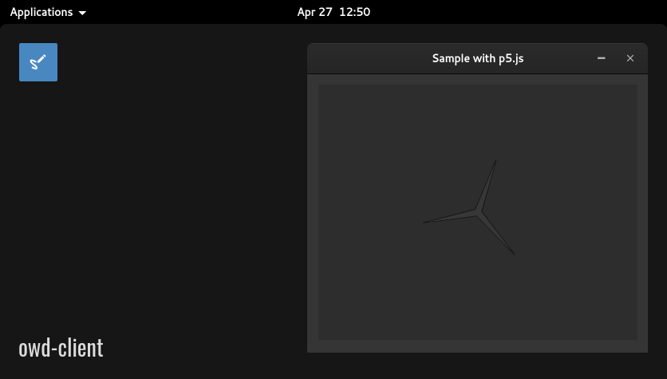

# Iframe module for OWD Client
> An iframe module to show any page into Open Web Desktop

    

    
    
    
    
    

## Demo
[Try it out](https://hacklover.net/client), just open the terminal and type "iframe"

## Overview
It's a demo module that shows how to create an iframe window using the \<WindowIframe> component.

## Quick install
- Copy the content of the `client` module folder into `owd-client/src/modules/iframe`
- Add the reference of this module into `owd-client/config/modules.json`

## Compatibility
- Open Web Desktop client v2.0.0-alpha.3

## License
This project is released under the [MIT License](LICENSE)